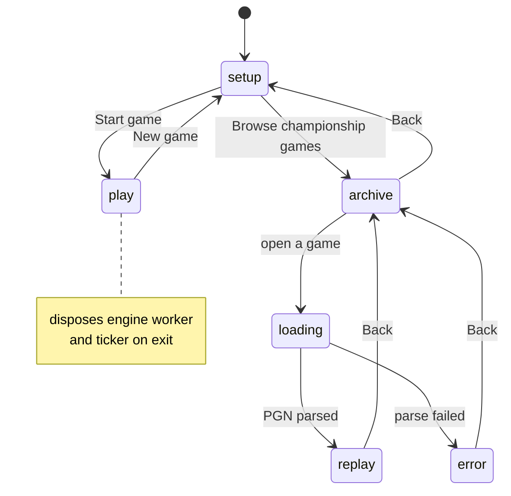
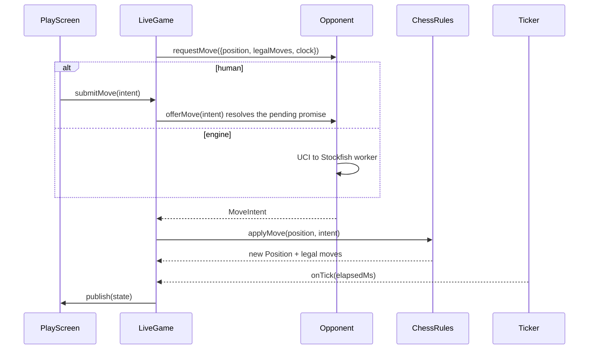
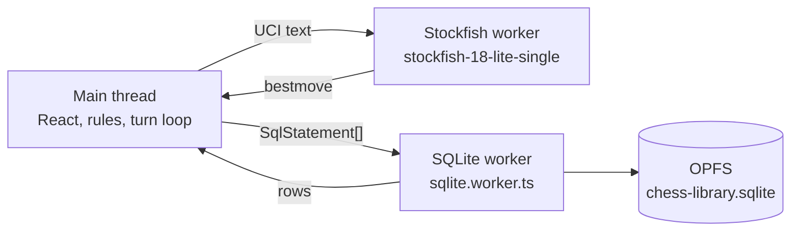
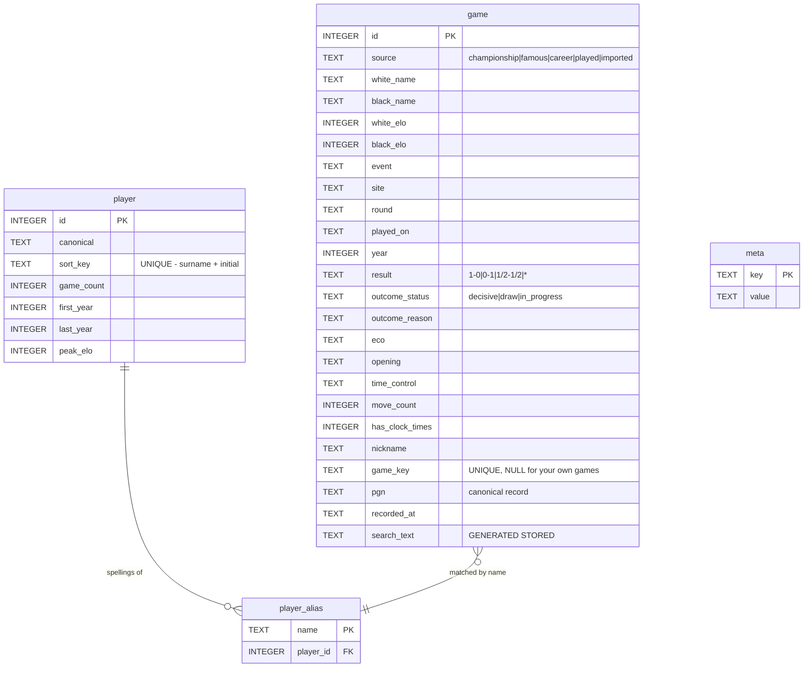

# Architecture and Security Review

A companion to the README. The README says what the app is and how to run it;
this says how it is built, what a DevSecOps review of it found, what was fixed,
what was deliberately left, and where the design honours or breaks the usual
principles — with the reasons, not just the verdicts.

Written after a review on 2026-07-29 covering the full attack surface, the
supply chain, the data pipeline, and the client-side hardening.

---

## 1. What this app is, architecturally

A **static single-page React app**. No server, no backend, no runtime API of its
own. Everything — the rules, the engine, the database — runs in the browser.

That single fact drives most of what follows. There is no server to validate
input, hold secrets, or enforce authorisation, and nothing to attack on the
server side because there is no server side. What remains is the client, the
data it ingests, and the pipeline that builds it.

| Concern | Where it lives |
| --- | --- |
| Rules and model | `src/domain/` — pure TypeScript, no libraries |
| Use cases | `src/application/` — turn loop, replay, difficulty |
| Adapters | `src/infrastructure/` — chess.js, Stockfish, SQLite, PGN |
| UI | `src/presentation/` — React |
| Wiring | `src/composition/` — the only place naming concrete classes |
| Build-time data | `scripts/` — fetches and builds the game library |

---

## 2. Application flow

### 2.1 Screen flow

`App.tsx` owns which screen shows and the lifetime of what that screen drives.
Games and replay sessions hold real resources — an engine worker, a running
timer — so every transition disposes what it replaces rather than leaving it to
each screen's unmount.



### 2.2 The turn loop

The abstraction the whole design turns on is `Opponent`. A person at the
keyboard and a search engine satisfy the same contract, so `LiveGame` runs **one**
loop rather than a branch per game mode.



A human move resolves a pending promise; the engine's resolves from a worker.
A networked opponent would be a third implementation and the loop would not
change.

### 2.3 Threads

Three execution contexts, each for a hard reason:



- **SQLite must be in a worker.** `createSyncAccessHandle`, which the persistent
  storage backend is built on, exists only in worker scope. On the main thread it
  is `undefined` and nothing could ever be saved. Keeping queries off the main
  thread is a side effect, not the reason.
- **Stockfish is in a worker** because search is CPU-bound and would otherwise
  freeze the board on every move it thinks about.
- The **single-threaded** engine build is deliberate: the threaded builds need
  `SharedArrayBuffer`, which needs COOP/COEP headers, which would cost the app
  its ability to deploy as plain static files.

---

## 3. Database

### 3.1 Where it lives

**SQLite compiled to WebAssembly, stored in the browser's Origin Private File
System** as `chess-library.sqlite`, via the SAH-pool VFS named `chess-library`.

Per origin, per browser profile, on the user's own machine. Never uploaded,
never a file in this repo. Two documented fallbacks to an in-memory database,
both reported to the UI rather than hidden:

| Condition | Result |
| --- | --- |
| No OPFS (private window, older browser) | in-memory, `reason: 'no-storage'` |
| Another tab holds the access handles | in-memory, `reason: 'another-tab'` |
| OPFS but persistence not granted | durable, `evictable: true` |

### 3.2 Schema

Four tables. `SCHEMA_VERSION` bumps for any structural change;
`LIBRARY_VERSION` bumps when bundled collections change. They move for
different reasons, so they are separate.



**Design decisions worth knowing:**

- **`pgn` is the canonical record.** Every metadata column is a queryable index
  over it, not a replacement. Export is therefore lossless — the bytes that went
  in come back out. This is why `exportPgn` reads the stored text rather than
  re-serialising the parsed form, which would quietly drop anything the app does
  not model.
- **There is no `move` table, on purpose.** PGN already encodes per-move clock
  times as `[%clk]` comments, which the replay code already reads. A move table
  would mean ~230,000 rows and a second source of truth competing with the PGN,
  for no capability this app needs.
- **`game_key` is `NULL` for games you played.** SQLite permits many NULLs in a
  unique index, so the constraint makes re-imports impossible while leaving your
  own short games free to be identical to each other.
- **`search_text` is generated and deliberately unindexed.** Substring search
  cannot use a B-tree and scanning a few thousand rows is sub-millisecond. The
  column exists so case-folding lives in exactly one place.
- **`player_alias` exists because the same person is spelled several ways.**
  "Anand,V" and "Anand, Viswanathan" resolve to one identity, so asking for a
  player's games returns all of them.
- **A schema change rebuilds the table and carries your own games across.** The
  bundled collections are re-importable; only games you played are
  irreplaceable. A version bump must never cost someone a game.

### 3.3 Migration safety

`migrate()` drops and rebuilds `game`, re-inserting rows whose `source` is
neither `championship` nor `famous`. This was checked specifically during the
review because the comment promises no game is ever lost: multi-statement
batches run inside `BEGIN`/`COMMIT` with `ROLLBACK` on failure
(`sqlite.worker.ts`), so a partial failure cannot leave the table half-built.
The promise holds.

---

## 4. APIs

The app exposes **no API**. What it has instead:

### 4.1 Internal ports (the seams)

| Port | Purpose | Implementations |
| --- | --- | --- |
| `Opponent` / `InteractiveOpponent` | whoever is to move | `HumanOpponent`, `EngineOpponent` |
| `ChessEngine` | move-choosing ability | `StockfishEngine` |
| `ChessRules` | legality and position transitions | `ChessJsRules` |
| `Ticker` | elapsed time | `IntervalTicker` |
| `GameArchive` | reading the library | `SqliteGameArchive` |
| `GameStore` | writing the library | `SqliteGameArchive` |

`GameArchive` and `GameStore` are two interfaces over one adapter so a browsing
screen is never handed the ability to delete.

### 4.2 External data, fetched at build time only

Nothing here runs at runtime. These are `scripts/` reaching the network on a
developer's machine.

| Source | Used by | Notes |
| --- | --- | --- |
| `api.github.com` → `mainali123/Chess-Dataset` | `fetch-games.mjs` | 50 championship PGNs |
| `pgnmentor.com/players/*.zip` | `fetch-famous-games.mjs`, `fetch-modern-championships.mjs`, `fetch-careers.mjs` | per-player collections |
| `ratings.fide.com/.../standard_rating_list.zip` | `fetch-federations.mjs` | federations and titles |

The three collections the app serves are **committed**, so a clone, a dev start
and a build need no network at all. `prepare-assets.mjs` guards on the finished
collections rather than the intermediate downloads, which is what actually
removes the network from the common path.

### 4.3 Runtime network calls

Only same-origin fetches of the app's own PGN files, and only on first visit.
The CSP pins this with `connect-src 'self'`.

---

## 5. PGN: import, export, and where files come from

PGN (Portable Game Notation) is the plain-text standard every chess program
reads. It is this app's only interchange format, in both directions, and the
canonical form in which games are stored — the `pgn` column is the record, and
the metadata columns are an index over it.

### 5.1 What ships with the app

2,987 games across three non-overlapping files, loaded automatically on first
visit and then read from the database on every visit after:

| File | Games |
| --- | --- |
| `world-championship-knockout.pgn` | 1,805 |
| `world-championship-title-matches.pgn` | 1,164 |
| `famous-games.pgn` | 18 |

Two much larger collections are built but **deliberately not served** — they are
tens of megabytes and would burden every visitor with games nobody asked for.
They live in `library/` for you to import by hand:

| File | Games |
| --- | --- |
| `optional-careers.pgn` | 107,352 |
| `optional-elite-tournaments.pgn` | 20,225 |

### 5.2 Importing

**Browse championship games → Import PGN**, then pick a `.pgn` file. Anything a
chess program can write, this can read.

What happens to it:

1. The file's size is checked **before** it is read — reading is the part that
   freezes the tab, so a message afterwards would arrive too late to help. The
   ceiling is **128 MB**, set by what a legitimate import weighs rather than what
   feels tidy: `optional-careers.pgn` alone is 69 MB.
2. The text is split into individual games and inserted in transactions of 500,
   with progress reported — the large collections run to six figures, and without
   that the app looks frozen for minutes.
3. Each game is fingerprinted. **Re-importing is safe**: the unique index on
   `game_key` rejects anything already held, and the count reported is the number
   actually added, not the number supplied. "Added 40,000" when it added none
   would be a lie.
4. Imported games are tagged `source = 'imported'`, which is what keeps them —
   along with games you played — safe across a schema rebuild.

The original file is never moved, altered, or read again. Only the parsed games
enter the database.

### 5.3 Exporting

**Browse championship games → Export mine** downloads `my-chess-games.pgn`.

It contains the games you **played or imported**, oldest first — not the bundled
collections, which ship with the app and are re-importable. The stored PGN is
returned exactly as it went in rather than re-serialised from the parsed form,
which would quietly drop anything the app does not model.

This is the only real recovery path. Storage permission (§3.1) reduces the
chance of the browser evicting the database, but nothing inside the browser
survives a user clearing site data. A file on disk does.

### 5.4 Where to get PGN files

| Source | What it has |
| --- | --- |
| [pgnmentor.com](https://www.pgnmentor.com) | Per-player career collections and tournament files. What this project's own career and famous-game collections are built from. |
| [Lichess](https://database.lichess.org) | Monthly dumps of every rated game played there. Enormous — split before importing. |
| [Lichess](https://lichess.org) / [Chess.com](https://www.chess.com) accounts | Both export your own games as PGN, which this app will then read. |
| [TWIC](https://theweekinchess.com) | Weekly tournament bulletins going back decades. |
| [mainali123/Chess-Dataset](https://github.com/mainali123/Chess-Dataset) | The World Championship dataset this project's championship collection came from. |
| Any chess program | SCID, ChessBase, Arena and the rest all write PGN. |

Two practical notes. Files above 128 MB must be split — the Lichess monthly
dumps are far past that. And a collection with no `[Event]` tags will not split
into games correctly, because that tag is what marks a game boundary.

---

## 6. Security review

### 6.1 Verdict

The application code is well built: parameterised SQL throughout, no injection
sinks, atomic transactions, invariants documented where the decision was made.
The real exposure was never in `src/` — it was in the build pipeline and the
absence of anything enforcing the controls that already existed.

### 6.2 Findings and disposition

| ID | Finding | Status |
| --- | --- | --- |
| H1 | No automated enforcement of the checks the project already had | **Fixed** — tracked `.githooks/pre-commit` runs typecheck + tests; `npm run verify` adds `npm audit` |
| H2 | Build depended on an unpinned third-party dataset; whoever controlled it controlled every build | **Fixed** — the three served collections are committed |
| H3 | `fetch-games.mjs` claimed its download was committed while `.gitignore` excluded it | **Fixed** — comment corrected, and the claim is now true of the built collections |
| M1 | No Content-Security-Policy | **Fixed** — measured, then enforced (§6.3) |
| M2 | `unzip.mjs` inflated without a ceiling and read offsets straight from the archive | **Fixed** — 512 MB cap via `maxOutputLength`, every read range-checked |
| M3 | The 128 MB import limit lived only in the UI, outside the operation it protects | **Fixed** — `importPgn` enforces its own bound |
| L1 | UCI is newline-delimited; interpolated values could append commands | **Fixed** — `send()` refuses line breaks |
| L2 | Dependencies whole majors behind | **Fixed** — vite 6→8, vitest 3→4, TypeScript 5.9→7, Stockfish 11→18, react-chessboard 4→5 |
| L3 | `PRAGMA user_version` interpolates rather than binds | **Not a defect** — SQLite has no placeholder for PRAGMA values; the value is a module constant. Recorded so a future reviewer does not re-flag it |

**Verified clean:** no secrets anywhere; no XSS sinks (`innerHTML`,
`dangerouslySetInnerHTML`, `eval`, `new Function` all absent from `src/`); no
zip-slip (archive entries are read into memory, never written out by their own
name); `npm audit` reports nothing.

Because there is no server, no auth, and no runtime third-party calls, the
entire class of server-side findings does not apply.

### 6.3 The CSP, and how it was arrived at

```
default-src 'self'; script-src 'self' 'wasm-unsafe-eval'; worker-src 'self';
style-src 'self' 'unsafe-inline'; img-src 'self' data:; connect-src 'self';
object-src 'none'; base-uri 'none'; form-action 'none'
```

Every directive was **measured, not guessed**: served report-only first, with
`securitypolicyviolation` events collected while playing an engine game,
importing the library, and replaying an archived game — against both dev and the
production bundle. Controls were fired at the start and end of each run, so a
clean result means the policy held rather than that nothing was watching.

- `'wasm-unsafe-eval'` is required — the engine compiles WebAssembly, and a
  default policy blocks that outright.
- `'unsafe-eval'` is **withheld and proved unnecessary.** The one `new Function`
  in the Stockfish loader is the dead `else` branch of a `setImmediate` polyfill
  and never reported.
- `'unsafe-inline'` for styles is unavoidable: the board positions every square
  with a style attribute. A far smaller concession than script.
- Injected at **build only**. `@vitejs/plugin-react` emits an inline Refresh
  preamble in dev that `script-src 'self'` blocks, which leaves the page empty.
  Granting `'unsafe-inline'` to keep dev alive would weaken what ships to buy
  nothing, so dev runs unpoliced.
- `frame-ancestors` cannot be expressed in a `<meta>` tag, so it is set as a
  header in `public/staticwebapp.config.json`.

### 6.4 Still open

- **The two career collections (~101 MB) remain unpinned.** They are optional
  imports that never deploy, fetched by `fetch-careers.mjs` from
  `pgnmentor.com`. Committing them is not worth ~101 MB of permanent history; if
  their integrity ever matters, pin a checksum.
- **`fetch-federations.mjs` buffers a remote zip whole** before inflating it.
  Bounded now by the inflate cap, but the download itself is unbounded.

---

## 7. Bugs found, and what they taught

These came out of the review rather than from a bug report, which is the
argument for having done it.

### 7.1 A real World Championship game was missing

`build-library` rejected any record with an empty move list, on the
reasonable-sounding grounds that a game which will not play out is not a game.
**Kramnik forfeited game 5 of the 2006 title match** — it stands in the record as
`0-1` with nothing played. The library silently dropped it.

Two fixes were needed, and the second is the subtle one:

1. `validate()` accepts zero moves when the result is decisive, so a forfeit
   survives while an empty stub with no result is still dropped.
2. `isSameGame()` had to stop treating an empty move list as a prefix of
   everything. The empty string is a prefix of every string, so the forfeit read
   as a *truncated copy* of the first game by the same players in the same year
   and was discarded even once validation let it through.

Title matches went 1,163 → 1,164. Corroborating evidence that the fix landed:
`world-championship-raw.pgn` used to contribute exactly one game that no
processed collection carried, and now contributes none.

### 7.2 The dev server bound IPv6-only

Vite was left to choose its own bind address and listened on `[::1]` alone. A
browser resolving `localhost` to `127.0.0.1` got connection refused while the
server was up and answering over IPv6 — so `curl` from a shell reported success
while the browser could not load the page. Fixed with `--host`; `--strictPort`
was added at the same time so a busy port fails loudly instead of drifting to
the next one and serving a different app than the preview expects.

### 7.3 The test suite was not hermetic

`bundledLibrary.test.ts` called `readdirSync` at import time against
`public/games/`, which is generated. A worktree that had not fetched assets
failed the whole file and reported a *broken* library rather than an absent one —
and blocked the new pre-commit hook for an environment reason rather than a code
one, which is how a gate teaches people to reach for `--no-verify`. Now a
declared `describe.skipIf`, so vitest lists the checks as skipped and the gap
stays visible.

### 7.4 Upstream data defects

- **Gelfand–Gareev, World Blitz 2019** — `Invalid move in PGN: Qxe1`. Corrupt
  move text upstream. One game in 130,565.
- **The career fetchers write duplicates** — 9,601 of them, because per-player
  collections are concatenated and a game between two listed players arrives
  twice. This is **deliberate and documented**: `build-library` scores competing
  records and keeps the better one, so deduplicating at fetch time would discard
  that ability. Harmless to the app because `game_key` is unique; it only makes
  the "games added" count on import misleading.

### 7.5 react-chessboard 5 mount timing

Version 5 sizes itself from its container instead of taking a `boardWidth` prop.
Mounted in a commit *after* its screen's, while an ancestor re-renders — which
the play screen does on every clock tick — it renders its wrappers and no
squares, and never recovers: not on a resize event, a box change, or a full
option change.

Established by bisection on the live play screen: a bare board mounted with the
screen survives; one whose options are rebuilt every tick survives; an identical
bare board mounted one `setTimeout` later dies. So **deferring the mount is the
cause, not the cure** — the original wrapper gated mounting behind a measured
container size, which is exactly that late mount. The board now mounts in the
component's first commit and fills the area until the measured square lands a
commit later.

Version 5 also **removed the built-in promotion dialog**, so the app has its own,
built from `promotionChoices` — which means it offers the pieces the rules
actually allow rather than a fixed four.

---

## 8. Principles: where the design holds, and where it does not

The honest position is that this codebase applies these ideas **selectively**,
and the omissions are as considered as the applications.

### 8.1 Single Responsibility (SRP) — largely honoured

Held well:

- `Clock` knows about durations and stages. It does not know what time it is —
  callers advance it by an elapsed duration. That is precisely what lets live
  play and replay simulation share one implementation.
- `StockfishEngine` exists so that UCI — a line-oriented, stringly-typed,
  stateful protocol — stops at the edge of the system. Nothing above it knows
  what `go movetime 500` means.
- `App.tsx` owns screen choice *and* resource lifetime. Arguably two
  responsibilities; they are together on purpose, because splitting them is how
  a worker eventually leaks.

Strained:

- **`SqliteGameArchive` is the weak point.** It implements two ports, builds SQL,
  runs the one-time import, performs migrations, and rebuilds the player index —
  roughly 500 lines. Each piece is coherent and the comments explain why, but
  "the library" is a broad responsibility. If this file grows again, the player
  index is the natural thing to extract.
- `ArchiveScreen` holds filter state, sort state, pagination, import, and export.
  It is a screen, so some of that is inherent; it is nonetheless the largest
  component.

### 8.2 Open/Closed (OCP) — honoured where it matters

Adding a networked opponent requires a new `Opponent` implementation and no
change to `LiveGame`. Adding a difficulty level is a new entry in an array.
Swapping the rules library is a new `ChessRules` implementation.

Not honoured, deliberately: adding a *screen* means editing the `View` union and
the switch in `App.tsx`. A router or plugin registry would make that
closed-for-modification and buy nothing at five screens.

### 8.3 Liskov (LSP) — honoured, and load-bearing

`HumanOpponent` and `EngineOpponent` are genuinely substitutable: the loop calls
`requestMove` and awaits a promise, and neither implementation surprises it. The
one place the loop needs more, it asks by capability rather than by type —
`isInteractive()` narrows to `InteractiveOpponent` instead of
`instanceof HumanOpponent`. That is the difference between a substitutable
hierarchy and one with a type check bolted on.

### 8.4 Interface Segregation (ISP) — honoured, with a clear example

`GameArchive` and `GameStore` are separate interfaces implemented by one class,
specifically so browsing screens cannot delete. `ChessEngine` is deliberately
narrow — a move, not evaluations or principal variations — so everything
protocol-shaped stays in the adapter.

`GameArchive` itself is the counter-example: `list`, `load`, `importPgn`,
`durability`, `exportPgn`, `suggestPlayers`, `facets`. That is a wide interface,
and a screen that only lists games depends on all of it. Splitting it further
would be defensible; it has not earned it yet.

### 8.5 Dependency Inversion (DIP) — honoured strictly

`domain/` and `application/` import no React, no chess.js, no Stockfish, no
SQLite. Dependencies point inward only. `composition/services.ts` is the single
module that names concrete classes, and it is 85 lines.

The enforcement is a convention rather than a build rule — nothing fails if
someone imports React into `application/`. A lint rule (`import/no-restricted-paths`)
would make the boundary real instead of documented. That is the most valuable
architectural improvement still available, and it is not done.

### 8.6 Clean Architecture — followed in substance, not ceremony

The layering and the dependency rule are real. What is skipped:

- **No DI container.** A plain `createAppServices()` function is enough at this
  size.
- **No use-case-per-class.** `LiveGame` is one object with `start`, `submitMove`,
  `resign`, `agreeDraw`, `undo` rather than five command classes. They share
  state and a turn loop; splitting them would spread one cohesive thing across
  five files.
- **No repository wrapper over React state**, no CQRS, no event sourcing, no
  mediator. Ceremony at this size.

The tradeoff is honest: this is Clean Architecture's *dependency rule* without
its *file taxonomy*. Someone arriving expecting `CreateGameUseCase.ts` will not
find it. What they will find is a `domain/` they can read without knowing what
React is.

### 8.7 DRY — mostly, with two knowing duplications

Good: `gameKey` is one function; case-folding lives once in `search_text`;
`Clock` handles blitz and 1927 adjournments as the same shape.

Deliberately duplicated:

- **Game identity is implemented three times** — `gameKey.ts` (app),
  `scripts/lib/gameKey.mjs` (export script), and again in
  `audit-pgn-archive.mjs` / `dedupe-pgn-archive.mjs`. The app's is TypeScript
  behind path aliases; a build script that needs a compile step to run is a
  script nobody runs. `gameKey.test.ts` fails if the first two disagree, which
  converts the duplication from a risk into a checked invariant. The audit
  scripts are not covered by that test — a real if small gap.
- **The engine filename appears in two places** — `copy-engine.mjs` chooses it,
  `services.ts` references it. Nothing but a broken engine says so if they
  diverge. Both carry a comment pointing at the other; a generated constant
  would be better.

### 8.8 Summary

| Principle | Verdict | The tradeoff |
| --- | --- | --- |
| SRP | Mostly held | `SqliteGameArchive` does too much; extraction deferred until it grows again |
| OCP | Held where extension is likely | Screens are closed to extension by choice |
| LSP | Held, and load-bearing | Capability check (`isInteractive`) instead of type check |
| ISP | Held | `GameArchive` is wide; splitting not yet earned |
| DIP | Held strictly | Convention, not enforced by a lint rule — the top remaining gap |
| Clean Arch | Dependency rule yes, taxonomy no | No use-case classes, no DI container |
| DRY | Mostly | Game identity duplicated 3× for real reasons; 2 of 3 test-locked |

---

## 9. Verification

Everything above was checked rather than assumed.

| Gate | Result |
| --- | --- |
| `npm run typecheck` | clean |
| `npm test` | 82 passing, 9 files |
| `npm run build` | clean; CSP meta tag present in output |
| `npm audit` | 0 vulnerabilities |
| `npm run audit-pgn` | 130,565 games, 0 duplicates, 11,142,485 half-moves replayed |
| Browser | engine loads WASM and moves; archive imports and renders; click-to-move and drag-and-drop both play |

Two things remain unexercised: the promotion chooser needs a game reaching a
seventh-rank pawn, and storage persistence has only been observed being
*refused* — Chrome declines a low-engagement `localhost` origin, which is the
pessimistic path and the one worth having seen.
