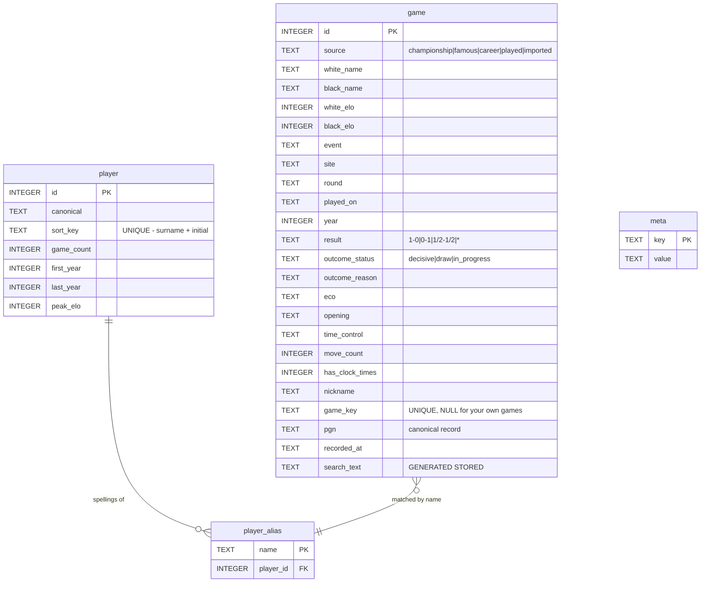
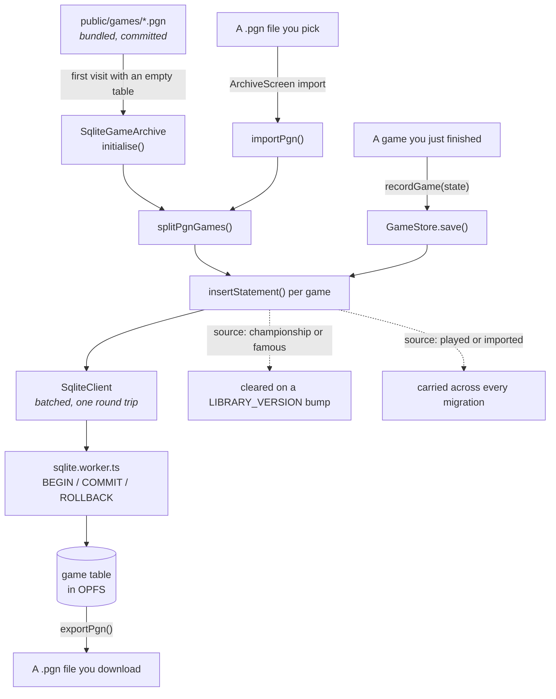

# The data model

One SQLite database, in the browser, holding both the bundled game collections
and everything you play or import. How it is reached at runtime is in
[FLOWS.md](FLOWS.md); the schema itself is defined in
`src/infrastructure/sqlite/schema.ts`, which is the source of truth this
document describes.

---

## Where it lives

**SQLite compiled to WebAssembly, stored in the browser's Origin Private File
System** as `chess-library.sqlite`, via the SAH-pool VFS named `chess-library`.

Per origin, per browser profile, on the user's own machine. Never uploaded,
never a file in this repo. Two documented fallbacks to an in-memory database,
both reported to the UI rather than hidden:

| Condition | Result |
| --- | --- |
| No OPFS (private window, older browser) | in-memory, `reason: 'no-storage'` |
| Another tab holds the access handles | in-memory, `reason: 'another-tab'` |
| OPFS but persistence not granted | durable, `evictable: true` |

---

## Schema

Four tables. `SCHEMA_VERSION` bumps for any structural change;
`LIBRARY_VERSION` bumps when bundled collections change. They move for
different reasons, so they are separate.

**Design decisions worth knowing:**

- **`pgn` is the canonical record.** Every metadata column is a queryable index
  over it, not a replacement. Export is therefore lossless — the bytes that went
  in come back out. This is why `exportPgn` reads the stored text rather than
  re-serialising the parsed form, which would quietly drop anything the app does
  not model.
- **There is no `move` table, on purpose.** PGN already encodes per-move clock
  times as `[%clk]` comments, which the replay code already reads. A move table
  would mean ~230,000 rows and a second source of truth competing with the PGN,
  for no capability this app needs.
- **`game_key` is `NULL` for games you played.** SQLite permits many NULLs in a
  unique index, so the constraint makes re-imports impossible while leaving your
  own short games free to be identical to each other.
- **`search_text` is generated and deliberately unindexed.** Substring search
  cannot use a B-tree and scanning a few thousand rows is sub-millisecond. The
  column exists so case-folding lives in exactly one place.
- **`player_alias` exists because the same person is spelled several ways.**
  "Anand,V" and "Anand, Viswanathan" resolve to one identity, so asking for a
  player's games returns all of them.
- **A schema change rebuilds the table and carries your own games across.** The
  bundled collections are re-importable; only games you played are
  irreplaceable. A version bump must never cost someone a game.

---

## How a row gets there

Four ways in, one way out. The distinction that matters is `source`: bundled
rows are re-importable and can be deleted freely, and your own rows never can.

That column is also what the interface is built on. **Championships** lists
`championship`, `famous` and `career`; **My games** lists `played` and
`imported`. They are one screen rendered under a scope rather than two, and
the scope is a single clause over `game_by_source_year`.

The split is not cosmetic — the behaviour already differed. Only your own rows
can be deleted, `exportPgn()` has always read `WHERE source IN ('played',
'imported')`, and an import only ever writes `imported`. Import and export
therefore live on My games and nowhere else, because there is nowhere else
they apply.

- **Bundled games import exactly once**, on the first visit that finds the table
  empty. Every visit after reads the database, so the PGN is never parsed again.
- **Imports are batched per transaction**, not per game — thousands of separate
  messages to the worker would cost far more than the inserts themselves.
- **Export reads the stored `pgn` column**, not a re-serialisation of the parsed
  form. That is what makes the round trip lossless.

---

## Two version numbers, and why they are separate

| Constant | Bump it when | Effect |
| --- | --- | --- |
| `SCHEMA_VERSION` | Any table, column, or index changes | `migrate()` rebuilds `game`, carrying your own games across |
| `LIBRARY_VERSION` | The bundled PGN collections change | Bundled rows are cleared and re-imported; yours are untouched |

They move for different reasons, which is the whole argument for two numbers.
Editing a PGN file with only a schema number would have no effect on anyone who
had already opened the app — bundled games are imported only into an empty
table, so a stale library would persist indefinitely.

The failure mode worth remembering: forgetting to bump `SCHEMA_VERSION` after
adding a table means existing databases never create it, and the first query
against it fails on startup.

---

## Migration safety

`migrate()` drops and rebuilds `game`, re-inserting rows whose `source` is
neither `championship` nor `famous`. This was checked specifically during the
review because the comment promises no game is ever lost: multi-statement
batches run inside `BEGIN`/`COMMIT` with `ROLLBACK` on failure
(`sqlite.worker.ts`), so a partial failure cannot leave the table half-built.
The promise holds.
