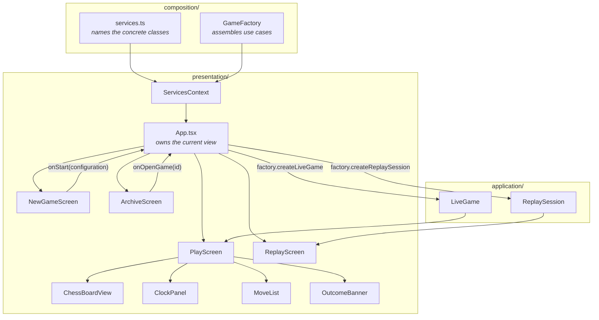
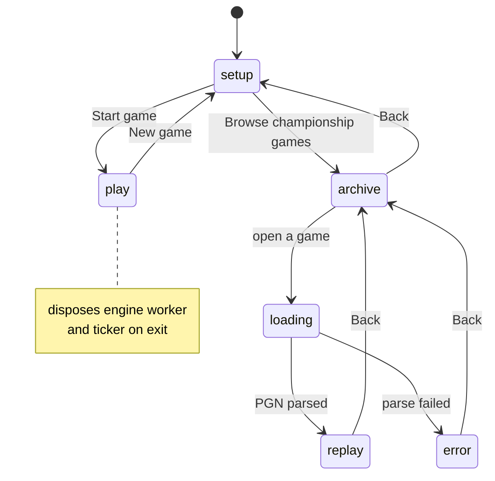
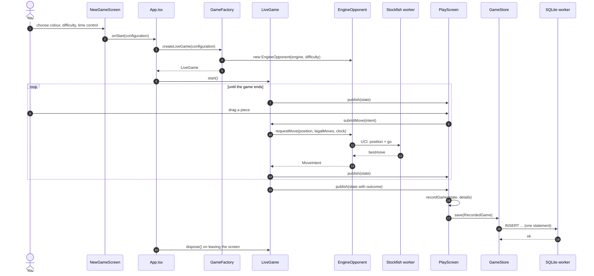
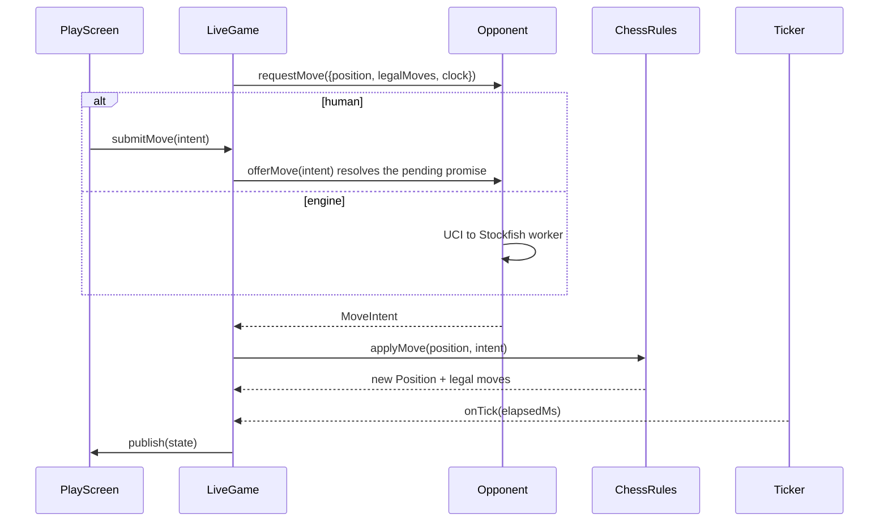
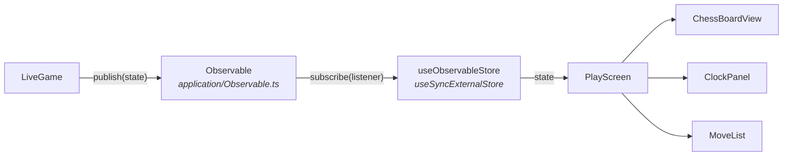
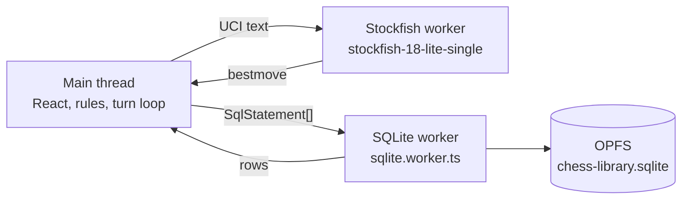

# Application flows

How a game gets from the setup screen to a stored result, and which piece talks
to which along the way. The layering that makes this shape possible is in
[ARCHITECTURE-AND-REVIEW.md](ARCHITECTURE-AND-REVIEW.md); what the stored result
looks like is in [DATA-MODEL.md](DATA-MODEL.md).

---

## How the pieces are wired

React sees two things and never more: `services` (the long-lived adapters) and
`factory` (which assembles use cases). Both arrive through `ServicesContext`, so
no screen ever constructs an engine, a database client, or a clock.

Two things this picture is meant to make obvious:

- **Screens do not talk to each other.** `NewGameScreen` reports a configuration
  upward and `ArchiveScreen` reports an id upward; `App` decides what that
  becomes. No screen imports another.
- **`LiveGame` sits below the UI, not inside it.** It has no idea React exists.
  `PlayScreen` subscribes to it, and could be replaced wholesale without the game
  noticing.

---

## Screen flow

`App.tsx` owns which screen shows and the lifetime of what that screen drives.
Games and replay sessions hold real resources — an engine worker, a running
timer — so every transition disposes what it replaces rather than leaving it to
each screen's unmount.

---

## A game, start to finish

The concrete path for one game against the engine — every hop from the click on
**Start** to a row in the library.

Worth noticing:

- **`recordGame` is a pure function.** It turns game state into a storable
  record with no database, browser, or clock involved — which is why it is
  testable on its own.
- **The engine's move and yours take the same path.** Both arrive at `LiveGame`
  as a `MoveIntent` from an `Opponent`. The loop has no branch for which is
  which.
- **Disposal is `App`'s job, not the screen's.** Leaving the game tears down the
  worker and the ticker. Leaving that to unmount would eventually leak one.

---

## The turn loop

The abstraction the whole design turns on is `Opponent`. A person at the
keyboard and a search engine satisfy the same contract, so `LiveGame` runs **one**
loop rather than a branch per game mode.

A human move resolves a pending promise; the engine's resolves from a worker.
A networked opponent would be a third implementation and the loop would not
change.

---

## How state reaches the screen

`LiveGame` publishes; it does not know who is listening.

The subscription is the whole seam. `LiveGame` calls `publish()` after every
move, every tick, and every outcome; `useObservableStore` turns that into a
re-render. Nothing in `application/` imports React to make it happen, and a
different UI would subscribe the same way.

---

## Threads

Three execution contexts, each for a hard reason:

- **SQLite must be in a worker.** `createSyncAccessHandle`, which the persistent
  storage backend is built on, exists only in worker scope. On the main thread it
  is `undefined` and nothing could ever be saved. Keeping queries off the main
  thread is a side effect, not the reason.
- **Stockfish is in a worker** because search is CPU-bound and would otherwise
  freeze the board on every move it thinks about.
- The **single-threaded** engine build is deliberate: the threaded builds need
  `SharedArrayBuffer`, which needs COOP/COEP headers, which would cost the app
  its ability to deploy as plain static files.
